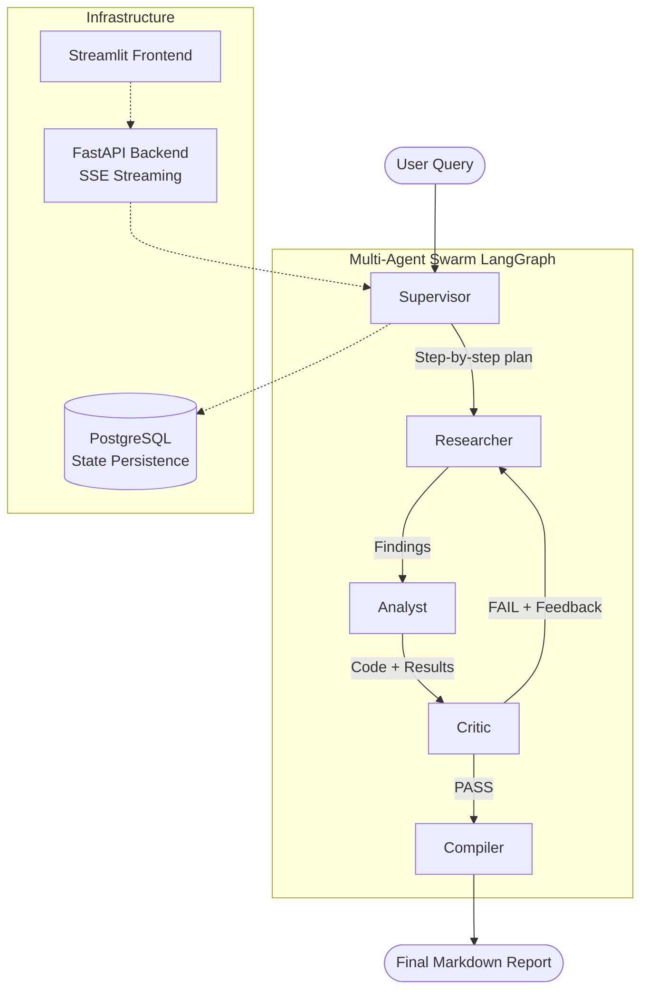

# AutoAnalyst AI 🔬
### Autonomous Multi-Agent Research & Data Analysis System

> **Ask a complex research question. Get a cited, quantitative report — automatically.**

<!-- Replace this line with your demo GIF:  -->

---

## Architecture



**Linear flow:**
```
User Input
    │
    ▼
Supervisor Agent  ──► Breaks query into a step-by-step plan
    │
    ▼
Researcher Agent  ──► Tavily web search (real-time data)
    │
    ▼
Analyst Agent     ──► Python code execution in E2B sandbox (CAGR, charts)
    │
    ▼
Critic Agent      ──► Validates output against original query
    │
    ├── FAIL ──► loops back to Researcher (max 3 revisions)
    │
    └── PASS ──►
              │
              ▼
         Compiler Agent  ──► Final structured Markdown report
```

---

## Tech Stack

| Layer | Technology |
|---|---|
| Agent Orchestration | LangGraph StateGraph |
| LLM | GPT-4o / Claude 3.5 Sonnet |
| Web Search | Tavily Search API |
| Code Execution | E2B Code Interpreter SDK |
| State Persistence | PostgreSQL + LangGraph PostgresSaver |
| Backend API | FastAPI (SSE streaming) |
| Frontend | Streamlit |
| Observability | LangSmith |
| Infrastructure | Docker + Docker Compose |

---

## 🧠 Key Engineering Challenges Solved

- **State Persistence & Human-in-the-Loop (HITL):** Integrated `langgraph.checkpoint.postgres` to persist the full `AgentState` at every node transition. Long-running research tasks survive backend restarts, and the architecture supports future HITL breakpoints where a user can approve the Analyst's generated code before it executes.

- **Infinite Loop Prevention:** Implemented a `revision_count` counter in the shared state. If the Critic fails the output 3 consecutive times, the graph forces a transition to the Compiler regardless — preventing infinite agent debates and runaway API costs.

- **Secure Code Execution:** Replaced a local `PythonREPL` with the **E2B Code Interpreter SDK**. The Analyst Agent's generated Python runs in an isolated, ephemeral cloud sandbox — no generated code ever touches the host infrastructure.

- **Real-Time Observability via SSE:** Implemented Server-Sent Events in FastAPI to stream each agent's internal output (search queries, code, critic verdicts) to the Streamlit UI in real-time as the graph executes, rather than blocking until the final answer.

- **Structured Critic Output:** The Critic Agent is prompted to return strict JSON (`{"verdict": "pass/fail", "feedback": "..."}`) parsed with LangChain's `JsonOutputParser`. This makes the routing logic deterministic and prevents the graph from misrouting due to freeform LLM text.

---

## 📂 Project Structure

```text
├── backend/
│   ├── agents/
│   │   ├── supervisor.py    # Breaks query into a numbered research plan
│   │   ├── researcher.py    # Agentic Tavily search loop (up to 8 rounds)
│   │   ├── analyst.py       # Writes + executes Python in E2B sandbox
│   │   ├── critic.py        # JSON verdict: pass/fail with specific feedback
│   │   └── compiler.py      # Assembles final structured Markdown report
│   ├── graph/
│   │   ├── state.py         # Shared AgentState TypedDict
│   │   └── workflow.py      # LangGraph StateGraph wiring + conditional routing
│   ├── tools/
│   │   ├── search.py        # Tavily tool wrapper
│   │   └── code_executor.py # E2B sandbox runner (stdout, stderr, chart image)
│   ├── api/
│   │   └── main.py          # FastAPI: /analyze (blocking) + /analyze/stream (SSE)
│   ├── config.py            # Env loader + LLM factory (OpenAI / Anthropic)
│   └── requirements.txt
├── frontend/
│   ├── app.py               # Streamlit chat UI with live agent thought expanders
│   └── requirements.txt
├── postgres/
│   └── init.sql
├── docker-compose.yml       # Orchestrates backend, frontend, PostgreSQL
├── Dockerfile.backend
├── Dockerfile.frontend
├── .env.example
└── README.md
```

---

## Quick Start

### 1. Configure environment

```bash
cp .env.example .env
# Fill in your API keys in .env
```

Required keys:
- `OPENAI_API_KEY` or `ANTHROPIC_API_KEY`
- `TAVILY_API_KEY` — get at https://tavily.com
- `E2B_API_KEY` — get at https://e2b.dev

### 2. Run with Docker

```bash
docker-compose up --build
```

| Service | URL |
|---|---|
| Frontend | http://localhost:8501 |
| Backend API | http://localhost:8000 |
| API Docs | http://localhost:8000/docs |

### 3. Run locally (without Docker)

```bash
# Backend
pip install -r backend/requirements.txt
uvicorn backend.api.main:app --reload --port 8000

# Frontend (separate terminal)
pip install -r frontend/requirements.txt
streamlit run frontend/app.py
```

> For local runs without Docker, set `DATABASE_URL` to your local PostgreSQL instance or leave it empty to run without state persistence.

---

## 🔭 Observability & Tracing

Multi-agent systems are notoriously difficult to debug. This project is instrumented with **LangSmith** to trace every LLM call, tool execution, and state transition across the graph.

Set these in your `.env` to enable tracing:

```bash
LANGCHAIN_TRACING_V2=true
LANGCHAIN_API_KEY=your_langsmith_api_key
LANGCHAIN_PROJECT=autoanalyst-ai
```

What you get:
- **Trace Graph** — visualize the exact path the Supervisor took to route the query and how many Critic revision loops occurred
- **Token Analytics** — monitor token consumption per agent to identify bottlenecks (e.g., if the Researcher is consuming 80% of the context window)
- **Latency Tracking** — measure end-to-end graph execution time and individual node latencies
- **Tool Call Inspection** — see every Tavily search query issued and the raw results returned

---

## Example Queries

- *"Analyze the current market size, key players, and technical bottlenecks of Solid State Batteries, and calculate the CAGR based on recent reports"*
- *"What is the global EV adoption rate? Compare top 5 countries and project growth to 2030."*
- *"Summarize the latest AI chip market landscape and calculate Nvidia's market share growth from 2022 to 2024."*
